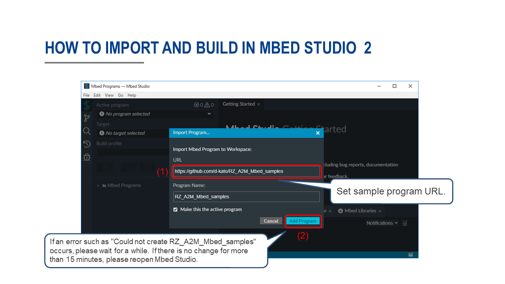
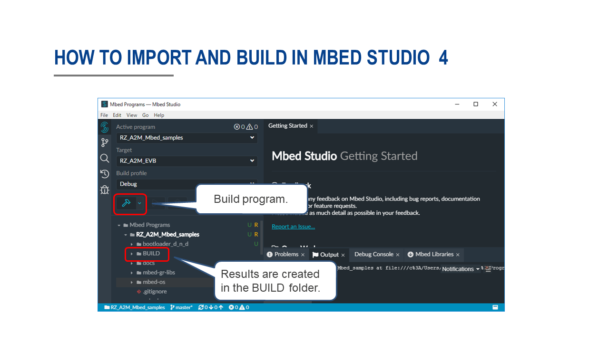
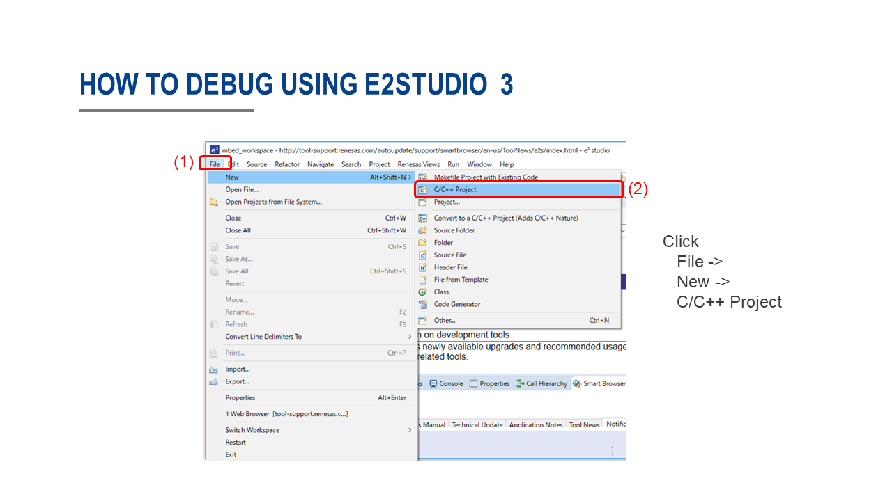
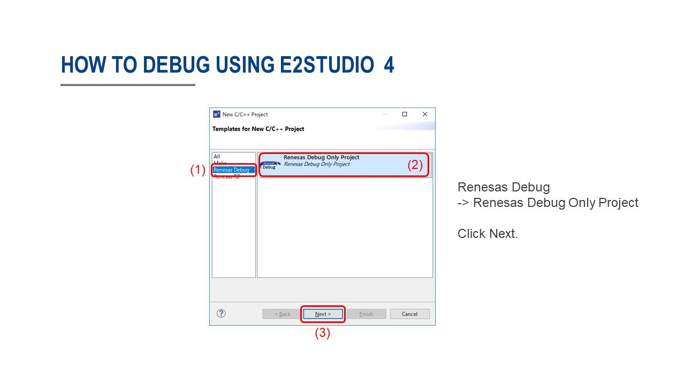
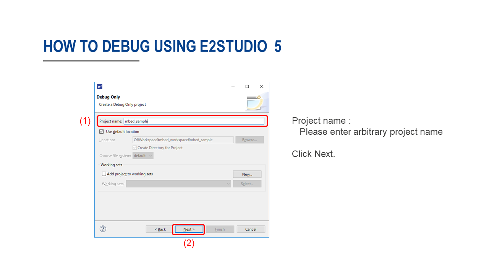
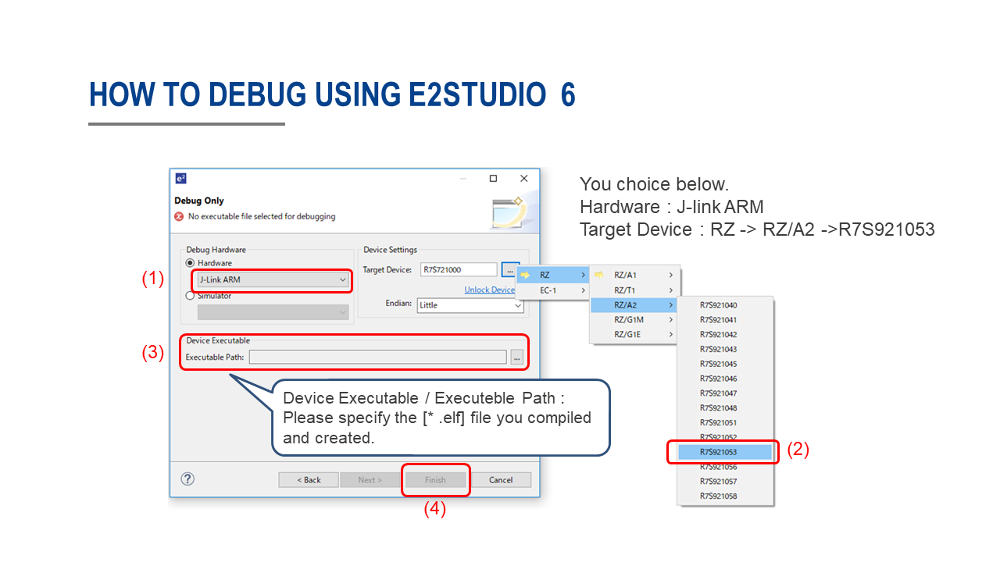
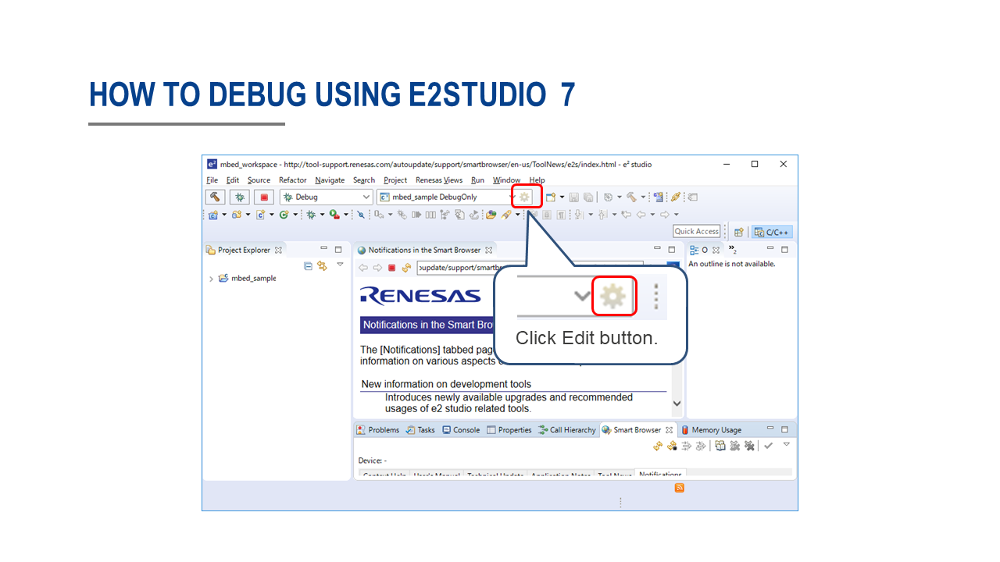
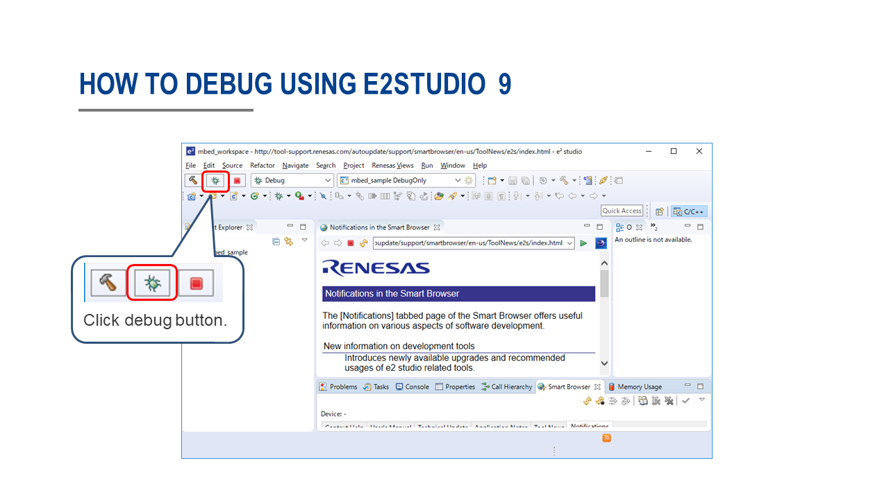

# RZ_A2M_Mbed_samples
This is a collection of sample programs that work on RZ/A2M boards.  
You can try Mbed OS for RZ/A2M with the following board.
- GR-MANGO beta version  
- [RZ/A2M Evaluation Board Kit](https://www.renesas.com/jp/en/products/software-tools/boards-and-kits/eval-kits/rz-a2m-evaluation-board-kit.html)  
- [SBEV-RZ/A2M](http://www.shimafuji.co.jp/products/1486)  
- [SEMB1402](http://www.shimafuji.co.jp/products/1505)  


## Overview
Sample program files are located under the ``sample_programs`` folder.  
You can try each sample program by changing the following macro in``sample_select.h``.  
```cpp
#define SAMPLE_PROGRAM_NO  0
```

| No.| Program file                                                                          | Description                                                  | A | B | C | D | E | F |
|:---|:--------------------------------------------------------------------------------------|:-------------------------------------------------------------|:--|:--|:--|:--|:--|:--|
|  0 | [sample_00_led_rtc_analogin.cpp](sample_programs/sample_00_led_rtc_analogin.cpp)      | DigitalOut, InterruptIn, RTC, Timer and AnalogI              | x | x | x | x | x | x |
|  1 | [sample_01_flash_write.cpp](sample_programs/sample_01_flash_write.cpp)                | FlashAPI sample                                              | x | x | x | x | x | x |
|  2 | [sample_02_ssif_loop_back.cpp](sample_programs/sample_02_ssif_loop_back.cpp)          | SSIF loop back sample                                        | x | x | x | x |   |   |
|  3 | [sample_03_spdif_loop_back.cpp](sample_programs/sample_03_spdif_loop_back.cpp)        | SPDIF loop back sample                                       |   |   |   | x |   |   |
|  4 | [sample_04_ssif_wav_playback.cpp](sample_programs/sample_04_ssif_wav_playback.cpp)    | SSIF wav playback sample (use USB memory or SD card)         | x | x | x | x |   |   |
|  5 | [sample_05_spdif_wav_playback.cpp](sample_programs/sample_05_spdif_wav_playback.cpp)  | SPDIF wav playback sample (use USB memory or SD card)        |   |   |   | x |   |   |
|  6 | [sample_06_lcd_touch_jcu.cpp](sample_programs/sample_06_lcd_touch_jcu.cpp)            | LCD, Touch panel and JCU sample (use USB memory or SD card)  | x | x |   | x |   |   |
|  7 | [sample_07_usb_func_serial.cpp](sample_programs/sample_07_usb_func_serial.cpp)        | USBSerial (CDC) sample [\*1]                                 | x | x | x | x | x | x |
|  8 | [sample_08_usb_func_mouse.cpp](sample_programs/sample_08_usb_func_mouse.cpp)          | USBMouse sample [\*1]                                        | x | x | x | x | x | x |
|  9 | [sample_09_usb_func_keyboard.cpp](sample_programs/sample_09_usb_func_keyboard.cpp)    | USBKeyboard sample [\*1]                                     | x | x | x | x | x | x |
| 10 | [sample_10_usb_func_midi.cpp](sample_programs/sample_10_usb_func_midi.cpp)            | USBMIDI sample [\*1]                                         | x | x | x | x | x | x |
| 11 | [sample_11_usb_func_audio_1.cpp](sample_programs/sample_11_usb_func_audio_1.cpp)      | USBAudio sample [\*1]                                        | x | x | x | x | x | x |
| 12 | [sample_12_usb_func_audio_2.cpp](sample_programs/sample_12_usb_func_audio_2.cpp)      | USBAudio and SSIF sample [\*1]                               | x | x | x | x |   |   |
| 13 | [sample_13_ether_http.cpp](sample_programs/sample_13_ether_http.cpp)                  | Ether HTTP sample                                            | x |   | x | x | x |   |
| 14 | [sample_14_ether_https.cpp](sample_programs/sample_14_ether_https.cpp)                | Ether HTTPS sample                                           | x |   | x | x | x |   |
| 15 | [sample_15_ceu_lcd_pwm.cpp](sample_programs/sample_15_ceu_lcd_pwm.cpp)                | CEU, LCD and PWM sample                                      |   |   |   | x |   |   |
| 16 | [sample_16_usb_func_msd_1.cpp](sample_programs/sample_16_usb_func_msd_1.cpp)          | USBMSD and FlashAPI sample [\*1]                             | x | x | x | x | x | x |
| 17 | [sample_17_usb_func_msd_2.cpp](sample_programs/sample_17_usb_func_msd_2.cpp)          | USBMSD and FlashAPI sample advanced version [\*1]            | x | x | x | x | x | x |
| 18 | [sample_18_mipi_drp_lcd.cpp](sample_programs/sample_18_mipi_drp_lcd.cpp)              | MIPI, DRP and LCD sample                                     |   |   | x | x | x | x |
| 19 | [sample_19_mipi_drp_diplayapp.cpp](sample_programs/sample_19_mipi_drp_diplayapp.cpp)  | MIPI, DRP and USBSerial (CDC) sample (use "DisplayApp") [\*1]|   |   | x | x | x | x |
| 20 | [sample_20_drp_dynamic_loading.cpp](sample_programs/sample_20_drp_dynamic_loading.cpp)| DRP Dynamic Loading Sample                                   |   |   | x | x | x | x |

A : [GR-PEACH](https://os.mbed.com/platforms/Renesas-GR-PEACH/) (RZ/A1H)  
B : [GR-LYCHEE](https://os.mbed.com/platforms/Renesas-GR-LYCHEE/) (RZ/A1LU)  
C : GR-MANGO beta version (RZ/A2M)  
D : [RZ/A2M Evaluation Board Kit](https://www.renesas.com/jp/en/products/software-tools/boards-and-kits/eval-kits/rz-a2m-evaluation-board-kit.html) (RZ/A2M)  
E : [SBEV-RZ/A2M](http://www.shimafuji.co.jp/products/1486) (RZ/A2M)  
F : [SEMB1402](http://www.shimafuji.co.jp/products/1505) (RZ/A2M)  

\*1: Delete the ``OVERRIDE_CONSOLE_USBSERIAL`` in the ``mbed_app.json`` to use USB function.  


## Board setting
- RZ/A2M Evaluation Board Kit  
Please set the dip switch SW1 of the CPU board as follows.
```
SW1-1  ON  
SW1-2  OFF  
SW1-3  ON   <- Set to OFF when using HyperFlash boot.
SW1-4  OFF  
SW1-5  OFF  
SW1-6  ON  
SW1-7  ON  
SW1-8  ON  
```
Please set the dip switch SW6 of the SUB board as follows.
```
SW6-1  OFF  
SW6-2  OFF  
SW6-3  OFF  
SW6-4  OFF  
SW6-5  ON  
SW6-6  ON  
SW6-7  ON  
SW6-8  OFF  
SW6-9  OFF  
SW6-10 OFF  
```

## About custom boot loaders
**<font color="Red">Attention! When using GR-MANGO, please use DAPLink without using a custom boot loader.</font>**  
This sample uses a custom boot loader, and you can drag & drop the "xxxx_application.bin" file to write the program.  

1. Hold down ``SW3 (UB0)`` and press the reset button. (Or turn on the power.)  
2. Connect the USB cable to the PC, you can find the ``MBED`` directory.  
3. Drag & drop ``xxxx_application.bin`` to the ``MBED`` directory.  
4. When writing is completed, press the reset button.  

**Attention!**  
This sample program uses custom boot loaders ``revision 4`` .  
For the first time only, you need to write a custom bootloader as following.  
[How to write a custom boot loader](https://github.com/d-kato/bootloader_d_n_d)  


## Development environment
You can use ``Mbed CLI (CUI)`` or ``Mbed Studio (GUI)``. Choose your preferred development environment.  


### When using Mbed CLI (CUI)
You can use ``GCC``, ``Arm Compiler 5``, ``Arm Compiler 6`` and ``IAR``. A license is required to use a compiler other than the ``GCC`` compiler. **<font color="Red">Attention! GR-MANGO supports only GCC_ARM.</font>**  
Information of Mbed CLI that includes install&quick start guide is as the following.  
[Installation](https://github.com/ARMmbed/mbed-cli/blob/1.8.3/README.md#installation)  

How to import and build this sample  
```
$ cd <projects directory>
$ mbed import https://github.com/d-kato/RZ_A2M_Mbed_samples
$ cd RZ_A2M_Mbed_samples
$ mbed compile -m <TARGET> -t GCC_ARM --profile debug
```

Set the following to ``<TARGET>``.  
- GR-MANGO beta version : ``GR_MANGO``  
- RZ/A2M Evaluation Board Kit :  
  Serial flash boot (CPU board SW1-3  ON) : ``RZ_A2M_EVB``   
  HyperFlash boot  (CPU board SW1-3  OFF) : ``RZ_A2M_EVB_HF``  
- SBEV-RZ/A2M : ``RZ_A2M_SBEV``  
- SEMB1402 : ``SEMB1402``  

See [About custom boot loaders](#about-custom-boot-loaders) for program writing.  
See [How to debug using e2studio](#how-to-debug-using-e2studio) for debugging.  


### When using Mbed Studio (GUI)
You can use ``Arm Compiler 6`` included with Mbed Studio for free.  
Information of Mbed Studio that includes install&quick start guide is as the following.  
[Installation](https://os.mbed.com/studio/)  

How to import and build this sample  
  
  
  
**Attention!** : When using the RZ/A2M Evaluation Board Kit with HyperFlash boot, select "Target" box to ``RZ_A2M_EVB_HF``.  
  


**Attention!**  
You can not debug using Mbed Studio. Use only for build purposes. Debug the elf file created by Mbed Studio using e2studio.  

See [About custom boot loaders](#about-custom-boot-loaders) for program writing.  
See [How to debug using e2studio](#how-to-debug-using-e2studio) for debugging.  


## Terminal setting
If you want to confirm the serial communication the terminal soft on your PC, please specify the below values.  
You can change the baud rate by ``platform.stio-baud-rate`` of ``mbed_app.json``.  

|             |         |
|:------------|:--------|
| Baud rate   | 115,200 |
| Data        | 8bit    |
| Parity      | none    |
| Stop        | 1bit    |
| Flow control| none    |

**Attention!**  
``SBEV-RZ/A2M`` and ``SEMB1402`` use the RZ/A2M's USB as the terminal. To use USB for other purposes, delete ``OVERRIDE_CONSOLE_USBSERIAL`` macro in ``mbed_app.json`` file.


## How to debug using e2studio
Download [e2studio 7.4.0 or lator](https://www.renesas.com/eu/en/products/software-tools/tools/ide/e2studio.html), and install. (Debugger : J-Link Base)  
Connect the J-Link to your board.  
  
  
  
  
  
  
  
  
  
  
